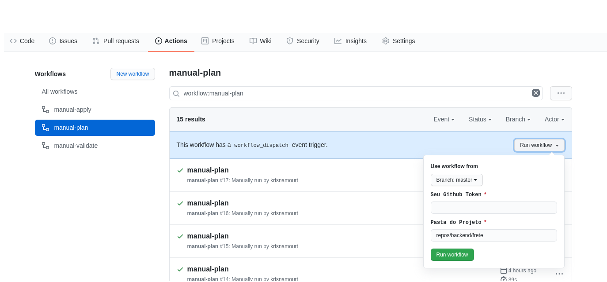

It’s well known that GIT is essential to any company that handle, in any level, some code and cloud solution as well as github, gitlab and bitbucket, mostly these days. Today I will tell you a little about the pain that is to manage repositories and their permissions, and why I ended up adopting terraform to manager my github.

As the company grows the same happens with git repositories growing exponentially and the lack of pattern spreads like a disease and of course the risk to some information leak becomes a reality. It’s hard a company start with all rules clearly defined and even on this case there’s no grantee o maintain all rules through the time, the change is a constant in any business. So in my case wasn’t different, there was a old way to work on our github based on forks plus the internal teams were always changing and the flow wasn’t really defined. After some discussion we came with our first proposal with the follow requirements:

- All repos have to created privately
- The possibility to add (or not) branch protection
- When there’re branch protection, all changes has to pass through a PR
- Minimal number of approvals in the master and all fixed branches
- A team to the master branch and another to the others
- Every team need to have its own permission, explicitly

I will speak briefly about the requirements we’ve decide to use on our “git flow”. We don’t work with public repos currently. Add git branches has to be optional because some repos are for study or test and could become a real project or not or some teams have just one or two members so, it’s not necessary. When we add these protections all changes required a PR, code review and has to be a minimum number of approvals. We adopted different teams between master and other branches for our “code freeze” processes without stop all development just more control about the deployments. I wouldn’t say that this our final flow but it’s a good beginning.

These definitions brought the question how to assure all of them at creation point and how to keep it after? This task was assigned to me and my journey started. My first attempt was github cli that’s a brand new tool but it’s much more a life cycle tool to manager the development after the repo’s creation, in my option github cli is more a extension to the git itself to decrease UI dependencies. Discarded in the first tests, so I tried github repo template but to be honest I didn’t get it what template means to them because it doesn’t brought branches and permission almost nothing, discarded. I bet on the API, I was already using in other scenarios, but branches were not supported and I face some difficult to create protections too, beside there’s a warning on the documentation page about API REST deprecation in favor of GRAPH API in the future, a this point I didn’t push forward. At the end I was drive to terraform as my last resource, I was aware about terraform modules to cloud repos but in my view using terraform to manager github disrespect some principals about immutable infra. On the first test I was able to achieve all requirements. In my head two options: create a home made solution or use terraform even not believing that is the right tool. Because of terraform deployment speed and to handle a lot of problems in our current scenario terraform was adopted almost immediately. Development a tool for this purpose wasn’t dropped just postponed.

In the middle of this processes using terraform I made an attempt to also manager users and teams, but github users aren’t created they are invited in an asynchronous processes that’s is so manual as use the console, in the end this was just another failed attempt.

After presenting to you the requirements and all decision-making process code finally. As a result I developed a terraform module that’s you can apply or not all the requirements that I mention take a look [here](https://github.com/krismorte/tf-github-repo). The basic operation is on the README and I copy below because I will use as an example in the entire article:


```terraform
provider "github" {
  token = "Your Github Token"
  #organization = "Your Organization" #for an enterprise account
  version = "3.0.0"
}

module "repos" {
  source                  = "github.com/krismorte/tf-github-repo?ref=v1.00"
  repo_name               = "my-repo"
  repo_desc               = "test repo example"
  default_branchs         = [""]
  add_protection          = false
  topics                  = ["test"]
  approval_per_branchs    = ""
  approval_master_branchs = ""
  approvals               = [""]
  teams                   = [""]
  collab                  = [""]
  collab_perm             = [""]
}
```

You can run this example against your personal account it’s really simple the result will be a private repo without any protection or additional permission, to run in any organization you have to uncomment `#organization` on the provider, [here]](https://www.terraform.io/docs/providers/github/index.html)  you can check the official documentation about this provider. We have all code we need but to really achieve success we also need a process.


The basic idea was follow a simple git flow, every new repo would be create through a PR with validate and plan, at the opened using git actions, and apply at merger with master. It’s a valid flow and for teams more used with git and cli it’s natural to follow this. In out case git isn’t so natural to our infra team and I got a better idea. Interesting to mention that at the same time I was also studying git actions and form that I met `workflow_dispatch` to manual trigger the pipeline and the possibility to pass inputs to trigger the pipe. With that in mind how about use the github interface as my form to create repos without any other tool or process to follow. An unorthodox idea but valid and easily adopted so hands-on.

In the process of creating and importing repos using terraform a problem emerged! Barely I had reached 20 repos and the time to run a simple plan increased too much. So before continuing I have to reorganize the project I broke the big project into small ones, separated by folders. Yes, every folder will be an independent project with the same structure and different backend and on and on. Small teams into a single folder big teams separated by area. At the time I had almost 300 repos to import and the time run all at once will make the project impossible. Until the article’s end I will talk about terraform import process. With more this change running time was kept less than 5 minutes and for me is an acceptable time.

Overcoming the runtime obstacle I come back to the strategy to use github as my form. Initially the idea was edit online the input file, and to run the pipeline would be necessary inform your github token, but now with a lot of small projects in different folder it will be necessary inform the folder too. The input folder was really easily and simple `cd` command handle it all but github token as a input was displayed in the pipe logs, a hell of security issue. When I started my research I found a lot of complain about this problem and issues opened at official git action repo. But in one of this issues my solution arise, thanks to [eric sciple](https://github.com/ericsciple) in this [issue](https://github.com/actions/runner/issues/475) saved my idea. Basically it got the input and encrypted before any mention on the pipe. Below you can see my gitaction to run a terraform plan receiving both values github token and the folder:


  ```yaml
  name: manual-plan
on: 
  workflow_dispatch:
    inputs:
      gitToken:
        description: 'Your github token'     
        required: true
      folder:
        description: 'Project fodler'     
        required: true
        default: 'repos/projecy'


env:
  AWS_ACCESS_KEY_ID: ${{ secrets.AWS_ACCESS_KEY_ID }}
  AWS_SECRET_ACCESS_KEY: ${{ secrets.AWS_SECRET_ACCESS_KEY }}  

jobs:  
  terraform:
    name: 'TF Plan'
    runs-on: ubuntu-18.04
    steps:
    - id: sets-a-secret
      run: |
        the_secret=$((RANDOM))
        echo "::add-mask::${{ github.event.inputs.gitToken }}"
        echo "::set-output name=secret-number::${{ github.event.inputs.gitToken }}"
    - run: |
        echo "the secret number is ${{ steps.sets-a-secret.outputs.secret-number }}"
    - name: Checkout
      uses: actions/checkout@v2   
    - name: Terraform Init && Validate
      run: cd ${{ github.event.inputs.folder }} && terraform init && terraform validate      
    - name: Terraform Init && Plan
      env:
        TF_VAR_github_token: ${{ steps.sets-a-secret.outputs.secret-number }}
      run: cd ${{ github.event.inputs.folder }} && terraform init && terraform plan --var-file=input.repo.tfvars
  ```

So to run a plan or an apply you have to inform your token and the folder as the image below:



All this help me to keep taking who is running which project and with small project separately I have a better damage control

Now going a littler deeper and how to bring all this to your code. First thing first keep in mind that all process requires a lot of patience in both ways create a new one or import a existing, terraform is a gradual process that required a lot of test, ok. Usually I write my code and run some plans to check with everything is write. From the names informed on the console I build my import commands. About which resource you will manager the most important ones will be the repo itself and its branches. I mention that because you can’t import branch protection and import user and permission it will be very laborious for something that state really doesn’t matter. So with my code prepared and tested and my import command in hand I just remove all branch protections and the permission form the repo before start and recreate it running an apply after the import process.

Using the code I copy at the article’s beginning and imagine that the repo `my-repo` already exists in your account, I can run a plan command:

```terraform
Resource actions are indicated with the following symbols:
  + create

Terraform will perform the following actions:

  # module.repos.github_repository.users_repos will be created
  + resource "github_repository" "users_repos" {
      + allow_merge_commit     = true
      + allow_rebase_merge     = true
      + allow_squash_merge     = true
      + archived               = false
      + auto_init              = true
      + default_branch         = (known after apply)
      + delete_branch_on_merge = true
      + description            = "test repo example"
      + etag                   = (known after apply)
      + full_name              = (known after apply)
      + git_clone_url          = (known after apply)
      + has_downloads          = true
      + has_issues             = true
      + has_projects           = true
      + has_wiki               = true
      + html_url               = (known after apply)
      + http_clone_url         = (known after apply)
      + id                     = (known after apply)
      + name                   = "my-repo"
      + node_id                = (known after apply)
      + private                = (known after apply)
      + ssh_clone_url          = (known after apply)
      + svn_url                = (known after apply)
      + topics                 = [
          + "test",
        ]
      + visibility             = "private"
    }

Plan: 1 to add, 0 to change, 0 to destroy.
```

with this plan I copy the resources names and build my import command:

```terraform
terraform import --var-secret=secret.tfvars 'module.repos.github_repository.users_repos' my-repo
```

Above I’m assuming that you, like myself, will use a separately file to keep the sensitive data a, secret file (.tfvars). You can also see that to import the repo you will use its name as reference

Below I will show the same example but now with additional branches:

at the code you have to fulfill the names list

```terraform
...
default_branchs         = ["staging",development]
...
```

your plan will show tow more resources


```terraform
...
  # module.repos.github_branch.branchs[0] will be created
  + resource "github_branch" "branchs" {
      + branch        = "staging"
      + etag          = (known after apply)
      + id            = (known after apply)
      + ref           = (known after apply)
      + repository    = "my-repo"
      + sha           = (known after apply)
      + source_branch = "master"
      + source_sha    = (known after apply)
    }

  # module.repos.github_branch.branchs[1] will be created
  + resource "github_branch" "branchs" {
      + branch        = "development"
      + etag          = (known after apply)
      + id            = (known after apply)
      + ref           = (known after apply)
      + repository    = "my-repo"
      + sha           = (known after apply)
      + source_branch = "master"
      + source_sha    = (known after apply)
    }
...
Plan: 3 to add, 0 to change, 0 to destroy.
...
```

and your import command will also have to import the branches

```terraform
terraform import --var-secret=secret.tfvars 'module.repos.github_repository.users_repos' my-repo
terraform import --var-secret=secret.tfvars 'module.repos.github_branch.branchs[0]' my-repo:staging
terraform import --var-secret=secret.tfvars 'module.repos.github_branch.branchs[0]' my-repo:development
```

At the end it’s very likely that something will change in your repo, be careful with any destroy that appears in your console. It’s funny that I have executed this procedures countless times for database, RDS, and the first time I’m writing about it’s about github in a new perspective.

The idea here it’s not to sell you the best way to manager repos in a cloud solution but show you one of the million ways to do it. This solution meets all my requirements but it’s not 100% finished. While I was written this article I found some small errors, some forgotten validations in my terraform module. So soon I will fix all of those but don’t worry nothing to break compatibility for now and I strong suggest you to use the tags on my module. I used simplistic examples to reach beginners and experienced terraform users. In real world I used another modules and the new feature `for_each` in all most everywhere. Who knows in the future I can review this article.