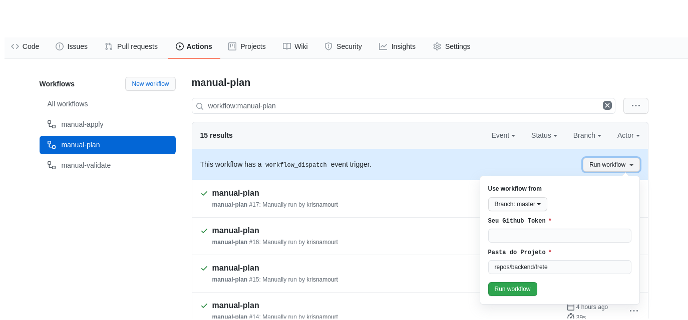

Não é novidade que o GIT hoje é essencial a qualquer empresa que trabalhe de alguma forma com softwares, e, consequêntemente alguma solução cloud como github, gitlab e bitbucket que atualmente são os principais. Hoje irei contar um pouco da dor de gerênciar repositórios e permissões e porque acabei por adotar o terraform como solução de gerência do github.

Conforme a empresa cresce a quantidade de repositórios no sue github tendem a crescer exponencialmente e assim a falta de padrão se torna um doência altamente contagiosa além, óbvio, do risco de vazamento de informações. Dificilmente uma empresa nasce com todos os padrões já definidos a serem seguidos rigosamente e mesmo quando o fazem nada garante que esses termos não mudarão com o tempo. Assim sendo na empresa que trablho não foi diferente, existia um padrão de trabalho baseado em forks, os times internamentes estavam constatemente mudando e não exitia um flow a ser seguido. Algo comum a muitas empresas de hoje, dai a partir de algumas dicussões internas e aprendisados foram decido que os requisitos mínimos que deveríamos seguir:

- Todos os repositórios devem nascer privados
- Adicionar ou não branch protection
- Quando tiver a branch protection habilitada toda alterção via PR
- Quantidade mínima de aprovadores por branch master e adicionais
- Um team de aprovadores com poderes na master
- Demais teams e colaboradores individuais e suas respectivas permissões

Vou falar brevemente dos requisitos que decidimos adotar no nosso "git flow". Não trabalhamos atualmetne com repositórios públicos, a adição de branch protection é opicional pois alguns projetos são apenas estudos e podem ou não evoluir a um artefato de fato ou tem apenas um dev responsável. Quando adicionamos as branch protections todas as alterações passam por PR, code review e devem ter uma quantidade mínima de aprovações. Nossa estrategia de ter teams diferentes entre a master e as demais branchs foi adotada pra facilitar o nosso processo de "code freeze" sem interrompoer o desenvolvimento das features, mas com maior controle do que entra pra produção. Não diria que de fato esse será o nosso git flow definitivo mais é um belo começo.

A partir dessas definições veio a questão como garantir a aplicação de todas as regras na criação do repo, e como mantê-los posteriormente? Essa tarefa foi dada a mim e a jornada foi iniciada. Minha primeira tentariva foi o github cli que é novidade, mas logo de cara vi que se tratava muito mais de um gerẽnciador o ciclo de vida posterior a criação de repositório do que a sua criação, na minha opinião o github cli é mais uma extensão ao git como forma de facilitar a adiministração de um git flow. Descartado logo nos primeiros testes, assim segui a opção de criar um repositório baseado em template, mas sinceramente nem entendi de fato que eles entenderam por template já que não trazia quase nada, não trazia branchs adicionais e nem as permissões. Fiz uma tentativa de usar a API do github, que já venho usando pra algumas outras atividades, mas branchs e branch protection ficaram de fora, além de um aviso na documentação que a API REST será descontinuada no futuro em favor da graph api, então não insisti muito. Acabou que o terraform foi minha última opção e a qual fiz o teste um pouco a contra gosto, pois na minha visão adminsitrar o github pelo terraform fura alguns princípios de infra imutavel, minha opinião.Na primeira tentativa com terraform foram atendidos todos os requisitos que tinhamos levantados. Na minha cabeça ficaram as seguintes opções: criar um solução customizada para atender todas as nossas necessidades; usar o terraform mesmo acreditando ue não era a ferramenta ideal. Pelo tempo e por alguns problemas recorrentes que tinhamos o terraform foi adotado imediatamente. A criação de uma ferramenta não foi descartada apenas adiada ao futuro. 

Vale ressaltar que na tentativa de adotar o terraform para a criação e gerências dos repositórios também foi realizado uma tentativa de administrar usuarios e teams, mas como usuarios dependem de um invite de maneira totalmente assíncrona o processo se tornou massante e tão manual quando usar o console, então essa opção saiu da mesa também.

Depois de apresentar os requisitos e o processo decisório finalmente o código. Depois de uma sequência de tentativas e arranjos acabei por criar um módulo que atende a todos os requisitos aqui descritos que está disponivel [aqui](https://github.com/krismorte/tf-github-repo). O funcionamento básico esta descrito no readme que irei repetir aqui e usar como exemplo até o final:

```terraform
provider "github" {
  token = "Your Github Token"
  #organization = "Your Organization" #for an enterprise account
  version = "3.0.0"
}

module "repos" {
  source                  = "github.com/krismorte/tf-github-repo?ref=v1.00"
  repo_name               = "my-repo"
  repo_desc               = "test repo example"
  default_branchs         = [""]
  add_protection          = false
  topics                  = ["test"]
  approval_per_branchs    = ""
  approval_master_branchs = ""
  approvals               = [""]
  teams                   = [""]
  collab                  = [""]
  collab_perm             = [""]
}
```

Caso queira executar um teste simples na sua conta pessoal o script acima funionará perfeitamente criando apenas o repositório de forma privada sem nenhuma proteção, se quiser testar na sua orgainização é preciso descomentar o trecho `#organization` do provider, e [aqui](https://www.terraform.io/docs/providers/github/index.html) vocẽ pode conferir melhor toda a documentação do provider oficial do github. Com isso tempos o básico, mas para a implantação de sucesso é preciso definir um processo de uso, de preferência de fácil adoção.

A ideia inicial foi de adotar um git flow bem simples, todo novo repositório seria aberto a partir de um PR, com validação e terraform plan na abertura, e execução na hora do merge na master. A ideia é válida e aos times mais habituados ao git e as cli a adoção desse fluxo seria imediata. No nosso caso o fluxo de git pra infra ainda não é algo 100% natural e ai outra ideia surgiu. Algo interessante de mencionar agora é que em paralelo ao processo de terraformar nosso github também estava a estudar o git actions. Desse estudos a opção do de disparo manual provida pelo `workflow_dispatch` mais a opção do github input onde eu posso passar alguns valores antes da execução do pipeline acabou por me atrair e surgiu a ideia onde o próprio repositório do github poderia ser meu formulário de criação de repositórios. Uma ideia não ortodoxa, mas válida e de fácil adoção, então mão s a massa.

No processo de criação e importação de repositórios usando terraform logo no ínicio ficou claro que o projeto cresceria rapidamente e um simples plan levaria, facilmente, mais de 10 minutos. Enfretei esse problema logo de inicio de projeto quando tinha importado ao código menos de 20 repositórios, então antes de dar contuindade mudança na estrategia. Mais a frete nesse artigo falarei um pouco mais do processo de importação do terraform. Eu tinha a frete mais de 200 repositórios o que tornaria o tempo de execução inviável ao projeto, então adotei a ideia de dividir o projeto principal em projetos menores, divisão por pasta mesmo, cada um com seu próprio código e backend separados. Criei pastas e subpastas por áreas e na áreas com mais projetos subdividi em times diminuindo os tempos de plan e apply para com no máximo 5 minutos. Pra mim um tempo bem aceitavel.

Superado o obstaculo de tempo de execução de volta ao github como formulário de criação dos repositório a ideia inicial era que cada executor tivesse que informar seu github token e agora com os projetos divididos em subpastas também seriam obrigado a informar qual projeto(pasta) gostariam de estar executando naquele momento. A questão das subastas foi facil de lidar, um simples `cd ...` e tuo resolvido, mas em relação ao token foi visto que o github exibe o valor do input no log do pipeline, um senhor furo de segurança. No github do actions há varias issues abertas reclamando disso. Algumas googladas depois descobri o processo informardo peloa [eric sciple](https://github.com/ericsciple) nesse [issue](https://github.com/actions/runner/issues/475) que salvou uma idea quase abandonada! Basicamente ele recebe o input e encprita ele antes de fazer qualquer refẽnciar. Abaixo o exemplo de como ficou meu git action recebendo git token e a pasta do projeto:

  ```yaml
  name: manual-plan
on: 
  workflow_dispatch:
    inputs:
      gitToken:
        description: 'Your github token'     
        required: true
      folder:
        description: 'Project fodler'     
        required: true
        default: 'repos/projecy'


env:
  AWS_ACCESS_KEY_ID: ${{ secrets.AWS_ACCESS_KEY_ID }}
  AWS_SECRET_ACCESS_KEY: ${{ secrets.AWS_SECRET_ACCESS_KEY }}  

jobs:  
  terraform:
    name: 'TF Plan'
    runs-on: ubuntu-18.04
    steps:
    - id: sets-a-secret
      run: |
        the_secret=$((RANDOM))
        echo "::add-mask::${{ github.event.inputs.gitToken }}"
        echo "::set-output name=secret-number::${{ github.event.inputs.gitToken }}"
    - run: |
        echo "the secret number is ${{ steps.sets-a-secret.outputs.secret-number }}"
    - name: Checkout
      uses: actions/checkout@v2   
    - name: Terraform Init && Validate
      run: cd ${{ github.event.inputs.folder }} && terraform init && terraform validate      
    - name: Terraform Init && Plan
      env:
        TF_VAR_github_token: ${{ steps.sets-a-secret.outputs.secret-number }}
      run: cd ${{ github.event.inputs.folder }} && terraform init && terraform plan --var-file=input.repo.tfvars
  ```

  Basicamente pra acionar o plan ou apply manualmente você é obrigado a informar seu github token e a pasta que deseja executar, conforme imagem abaixo:



Com isso pude usar o próprio github como formulário de criação de repositórios com validação, plan e apply do terraform de acordo com quem executa. 

Agora partindo um pouco de como trazer tudo que você já tem pra dentro do cpodigo. De ínicio é muito importante salientar que todo o processo requer muita paciência tanto da criação de uma ambiente como na importaão de algo existente, terraform é um processo gradual que requer muitos testes. Usualmente escrevo o código que será usando e executo um plan. A partir do que é informado no console monto os comandos de import do terraform. No caso desse projeto pontuo como essẽcnias ao import repositórios em questãos e as branchs que você quer gerênciar, pra não ter que importar cada recurso do projeto antes de executar um apply removo as branch protection já existentes e os teams e colaboradores com permissão no repositório e deixo que o terraform recrie tudo.

Usando o código que copiei do repositório do módulo e supondo que o repositório `my-repo` já exista sigo a seguinte sequência, escrevo o código, executo um plan, copia as os nomes dos recursos a serem criados e monto meu comando de import abaixo:

```terraform
Resource actions are indicated with the following symbols:
  + create

Terraform will perform the following actions:

  # module.repos.github_repository.users_repos will be created
  + resource "github_repository" "users_repos" {
      + allow_merge_commit     = true
      + allow_rebase_merge     = true
      + allow_squash_merge     = true
      + archived               = false
      + auto_init              = true
      + default_branch         = (known after apply)
      + delete_branch_on_merge = true
      + description            = "test repo example"
      + etag                   = (known after apply)
      + full_name              = (known after apply)
      + git_clone_url          = (known after apply)
      + has_downloads          = true
      + has_issues             = true
      + has_projects           = true
      + has_wiki               = true
      + html_url               = (known after apply)
      + http_clone_url         = (known after apply)
      + id                     = (known after apply)
      + name                   = "my-repo"
      + node_id                = (known after apply)
      + private                = (known after apply)
      + ssh_clone_url          = (known after apply)
      + svn_url                = (known after apply)
      + topics                 = [
          + "test",
        ]
      + visibility             = "private"
    }

Plan: 1 to add, 0 to change, 0 to destroy.
```

com o resutlado do plan executo o terraform import

```terraform
terraform import --var-secret=secret.tfvars 'module.repos.github_repository.users_repos' my-repo
```

No caso acima estou supondo que você irá usar, assim como eu faço, um arquivo de secrets separadamente e não direamente no módulo. Veja que o impor do reposiórios se dá usando o nome do mesmo. Abaixo mostro um exemplo completo caso seu reposiórios tenha algumas branchs adicionais:

no código do módulo seria adicionado os nomes das branchs

```terraform
...
default_branchs         = ["staging",development]
...
```

o plan apresentaria mais 2 recursos


```terraform
...
  # module.repos.github_branch.branchs[0] will be created
  + resource "github_branch" "branchs" {
      + branch        = "staging"
      + etag          = (known after apply)
      + id            = (known after apply)
      + ref           = (known after apply)
      + repository    = "my-repo"
      + sha           = (known after apply)
      + source_branch = "master"
      + source_sha    = (known after apply)
    }

  # module.repos.github_branch.branchs[1] will be created
  + resource "github_branch" "branchs" {
      + branch        = "development"
      + etag          = (known after apply)
      + id            = (known after apply)
      + ref           = (known after apply)
      + repository    = "my-repo"
      + sha           = (known after apply)
      + source_branch = "master"
      + source_sha    = (known after apply)
    }
...
Plan: 3 to add, 0 to change, 0 to destroy.
...
```

e o comando de import ficaria assim

```terraform
terraform import --var-secret=secret.tfvars 'module.repos.github_repository.users_repos' my-repo
terraform import --var-secret=secret.tfvars 'module.repos.github_branch.branchs[0]' my-repo:staging
terraform import --var-secret=secret.tfvars 'module.repos.github_branch.branchs[0]' my-repo:development
```

Ao finalizar os imports é bem provavel quem alguma alteração acabe por ocorrer no seu respoitório, muito cuidado com os `destroy` do terraform. Engraçado pontuar que usei essa opção do import do terraform inumeras vezes aos bancos de dados e a primeira vez que escrevo a respeito é sobre o github e não sobre o RDS.

A ideia deste artigo não é de sugerir a melhor maneira de se gerênciar seus repositórios na nuvem mais de apresentar uma maneira válida de fazê-lo. Essa solução hoje atende a os requisitos definidos internamente, mas que não esta 100% concluida. Ao escrever este artigo algumas falhas e esquecimentos em relaçaõ as variáveis do módulo passaram despercebidas, então logo-logo terei que fazer alguns ajustes nos código, nada que irá quebrar compatibilidade e caso isso ocorra sugiro que use as tags de versionamento do projeto. Os exemplos aqui apresentados são mais simplórios pois este artigo foi pensando em niveis introdutórios ao terraform. Na solução real utilizo uma das ultimas features lançadas pelo terraform o `for_each` quem sabe no futuro poss estender esse aritgo com algumas opções mais avançadas.